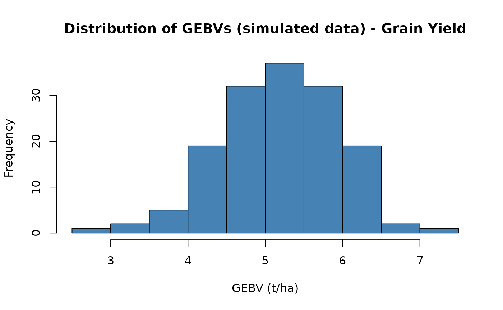

# Genomic Selection Pipeline with brapiR2

## Overview

This article demonstrates a complete genomic selection (GS) workflow
using brapiR2 to pull phenotypic and genotypic data from a
BrAPI-compliant server into R, then running GS models with rrBLUP, BGLR,
sommer, and AGHmatrix.

The
[`brapi_get_dosage_matrix()`](https://docs.ropensci.org/brapiR2/reference/brapi_get_dosage_matrix.md)
function returns a standard numeric matrix (samples x markers) that is
directly compatible with the major GS packages:

| Package | Usage |
|----|----|
| [rrBLUP](https://cran.r-project.org/package=rrBLUP) | `mixed.solve(y, Z = dosage)` |
| [BGLR](https://cran.r-project.org/package=BGLR) | `ETA = list(MRK = list(X = dosage, model = "BRR"))` |
| [sommer](https://cran.r-project.org/package=sommer) | `mmer(yield ~ 1, random = ~ vsr(germplasmName, Gu = A))` |
| [AGHmatrix](https://cran.r-project.org/package=AGHmatrix) | `Gmatrix(dosage, method = "VanRaden")` |

It has three parts: **Part 1** fetches real data from the public BrAPI
test server and shows exactly what brapiR2 returns. **Part 2** shows the
authenticated pattern you’d use against your own server, without running
it. **Part 3** runs the actual GS modelling on a simulated dataset,
because (as Part 1 demonstrates directly) the public server doesn’t have
enough real individuals with both phenotype and genotype data to fit and
validate a model.

## Part 1: Live Data from the Public Test Server

These calls run against `https://test-server.brapi.org` and require no
authentication.

``` r

library(brapiR2)
library(dplyr)
#> 
#> Attaching package: 'dplyr'
#> The following objects are masked from 'package:stats':
#> 
#>     filter, lag
#> The following objects are masked from 'package:base':
#> 
#>     intersect, setdiff, setequal, union

studies <- brapi_studies(con)
studies
#> # A tibble: 3 × 29
#>   additionalInfo   externalReferences active commonCropName contacts  
#>   <list>           <list>             <lgl>  <chr>          <list>    
#> 1 <named list [1]> <list [1]>         TRUE   Tomatillo      <list [1]>
#> 2 <named list [1]> <list [1]>         TRUE   Tomatillo      <list [1]>
#> 3 <named list [1]> <list [1]>         TRUE   Tomatillo      <list [1]>
#> # ℹ 24 more variables: culturalPractices <chr>, dataLinks <list>,
#> #   documentationURL <chr>, endDate <chr>, environmentParameters <list>,
#> #   experimentalDesign <list>, growthFacility <list>, lastUpdate <list>,
#> #   license <chr>, locationDbId <chr>, locationName <chr>,
#> #   observationLevels <list>, observationUnitsDescription <chr>,
#> #   seasons <list>, startDate <chr>, studyCode <chr>, studyDescription <chr>,
#> #   studyName <chr>, studyPUI <chr>, studyType <chr>, trialDbId <chr>, …

# brapi_study_data() falls back to fetching all observations and filtering
# client-side when a server (like this one) doesn't honour the studyDbId
# filter on /observations - so it succeeds even though a direct
# brapi_observations(con, studyDbId = ...) call would come back empty.
pheno_by_study <- lapply(studies$studyDbId, brapi_study_data, con = con)
#> ! No observations found for study "study2".
#> ! No observations found for study "study3".
names(pheno_by_study) <- studies$studyDbId
pheno_by_study[["study1"]]
#> # A tibble: 2 × 6
#>   observationUnitDbId observationUnitName germplasmDbId germplasmName  studyDbId
#>   <chr>               <chr>               <chr>         <chr>          <chr>    
#> 1 observation_unit1   Plot 1              germplasm1    Tomatillo Fan… study1   
#> 2 observation_unit2   Plot 2              germplasm2    Tomatillo Fan… study1   
#> # ℹ 1 more variable: `Corn Stalk Height` <list>
```

``` r

vsets <- brapi_variant_sets(con)
vsets
#> # A tibble: 1 × 11
#>   additionalInfo   externalReferences analysis   availableFormats callSetCount
#>   <list>           <list>             <list>     <list>                  <int>
#> 1 <named list [1]> <list [1]>         <list [1]> <list [3]>                 13
#> # ℹ 6 more variables: referenceSetDbId <chr>, studyDbId <chr>,
#> #   variantCount <int>, variantSetDbId <chr>, variantSetName <chr>,
#> #   metadataFields <list>

vs_id <- vsets$variantSetDbId[1]

## brapi_variants()'s referenceName/start are NA on this server (the BrAPI
## spec makes them optional - they place a variant on a reference
## assembly, and this server has none configured). brapi_get_marker_map()
## instead reads the Genome Maps entity (/markerpositions), which places
## each marker on a named map (genetic, cM, or physical, bp) and is
## populated here.
markers <- brapi_get_marker_map(con, variantSetDbId = vs_id)
#> ℹ Async search started (ID: c9fcf612-1075-430b-b366-504c42364fcf). Polling...
#> Warning: 14 of 20 variants in "variantset1" have no marker position record; returning
#> positions for the remaining 6.
markers
#> # A tibble: 6 × 8
#>   variantDbId variantName mapDbId  mapName type  unit  linkageGroupName position
#>   <chr>       <chr>       <chr>    <chr>   <chr> <chr> <chr>               <int>
#> 1 variant01   M1          genome_… Primar… Phys… cM    Chromosome 1          200
#> 2 variant02   M2          genome_… Primar… Phys… cM    Chromosome 1         4000
#> 3 variant03   M3          genome_… Primar… Phys… cM    Chromosome 1        60000
#> 4 variant04   M4          genome_… Primar… Phys… cM    Chromosome 2          200
#> 5 variant05   M5          genome_… Primar… Phys… cM    Chromosome 2         4000
#> 6 variant06   M6          genome_… Primar… Phys… cM    Chromosome 2        60000

dosage <- brapi_get_dosage_matrix(con, vs_id)
#> ℹ Fetching allele matrix for variant set "variantset1"...
#> ℹ Encoding 260 genotype calls as allele dosages...
#> ✔ Dosage matrix ready: 13 samples x 20 markers.
dim(dosage)
#> [1] 13 20
dosage[seq_len(min(5, nrow(dosage))), seq_len(min(6, ncol(dosage)))]
#>           variant01 variant02 variant03 variant04 variant05 variant06
#> callset01         0         0         0         0         0         1
#> callset02         1         0        NA        NA        NA        NA
#> callset03         1         0         1         1         0         0
#> callset04         1         0         1         1         0         1
#> callset05         1         0        NA         1         0         0
```

### Do phenotype and genotype records share any germplasm here?

This is the question that decides whether real genomic prediction is
possible against this server.
[`brapi_call_sets()`](https://docs.ropensci.org/brapiR2/reference/brapi_call_sets.md)
links a genotyped sample to a `sampleDbId`, and
[`brapi_samples()`](https://docs.ropensci.org/brapiR2/reference/brapi_samples.md)
links that same `sampleDbId` to a `germplasmDbId` - joining on
`sampleDbId` (not `callSetDbId`; they’re different ID spaces on this
server).

``` r

pheno_germplasm <- unique(unlist(lapply(pheno_by_study, function(d) {
  if (nrow(d) > 0 && "germplasmDbId" %in% names(d)) {
    d$germplasmDbId
  } else {
    character(0)
  }
})))
pheno_germplasm
#> [1] "germplasm1" "germplasm2"

call_sets <- brapi_call_sets(con, variantSetDbId = vs_id)
samples <- brapi_samples(con)

geno_germplasm <- samples |>
  filter(.data$sampleDbId %in% call_sets$sampleDbId) |>
  pull(.data$germplasmDbId) |>
  unique()
geno_germplasm
#> [1] "germplasm2" "germplasm1" "germplasm3"

overlap <- intersect(pheno_germplasm, geno_germplasm)
overlap
#> [1] "germplasm1" "germplasm2"
```

Real, live result: 2 germplasm have both phenotype and genotype records
on this server today. That is genuinely more than zero, but far short of
the dozens of individuals a real genomic prediction exercise needs to
fit a model and hold out a validation set. See
[`dev/explore-test-server.R`](https://github.com/ropensci/brapiR2/blob/main/dev/explore-test-server.R)
for the full survey this is drawn from. Part 3 below uses simulated data
so the modelling section can actually run.

## Part 2: Authenticated Access to Your Own Server (illustrative)

Production BrAPI servers (Breedbase, BMS, Germinate, …) require
credentials the public test server doesn’t need. This shows the pattern
— it is not run here, since it needs a real server and login of your
own.

``` r

con_priv <- brapi_connection("https://my-breedbase.org")
con_priv <- brapi_login(con_priv, "username", "password")

# Optional: enable caching so re-runs don't hit the server again
con_priv <- brapi_cache_enable(con_priv, ttl = 7200)

# Get phenotype data in wide format (one row per plot, one column per trait)
pheno_raw <- brapi_study_data(con_priv, "my_study_id")
pheno_raw

# Convert trait columns to numeric and drop missing
pheno <- pheno_raw |>
  mutate(across(Grain_Yield_t_ha:Thousand_Grain_Weight, as.numeric)) |>
  filter(!is.na(Grain_Yield_t_ha))
```

``` r

# List available variant sets to find the right genotyping dataset
vsets_priv <- brapi_variant_sets(con_priv)
vsets_priv

# Get dosage matrix: rows = samples (callSetDbIds),
# cols = markers (variantDbIds). Values: 0 (hom ref), 1 (het), 2 (hom alt),
# NA (missing)
dosage_priv <- brapi_get_dosage_matrix(con_priv, "vs001")
dim(dosage_priv)

# Get marker map for downstream QTL / Manhattan plots
markers_priv <- brapi_get_marker_map(con_priv, variantSetDbId = "vs001")
markers_priv
```

## Part 3: Genomic Selection on Simulated Data

Genomic prediction needs the same germplasm scored on both sides —
enough of them to fit marker effects and validate the fit. Part 1 showed
real brapiR2 output; it also showed why the public server can’t support
the model-fitting step: only 2 real germplasm have paired data there,
and no public BrAPI server currently provides the dozens-to-hundreds of
paired records genomic prediction actually needs. The rest of this
article uses a **simulated** dataset built with
[AlphaSimR](https://cran.r-project.org/package=AlphaSimR), generated
with a fixed seed so it is fully reproducible without server access.
Simulated values are labelled as such throughout.

``` r

# SIMULATED founder haplotypes. runMacs() runs a coalescent simulation
# (MaCS; Chen, Marjoram & Wall 2009) that produces markers with realistic
# linkage disequilibrium (LD) and shared ancestry between founders - unlike
# the independent per-marker draws used in earlier drafts of this article.
#
# Not run here: AlphaSimR does not expose R-level seed control for this
# coalescent step (set.seed() has no effect on runMacs() itself - verified,
# two runs with the same seed produce different founder haplotypes), so
# calling it at build time would make every number below change on every
# rebuild of this article. Instead, this call was run once, and its result
# saved to founderPop.rds (loaded below) so the article - including the
# reported cross-validation accuracy - is exactly reproducible.
library(AlphaSimR)

n_founders <- 150L # founder lines
n_sites    <- 800L # segregating sites simulated per chromosome

founderPop <- runMacs(
  nInd = n_founders, nChr = 1L, segSites = n_sites,
  species = "GENERIC", nThreads = 1L
)
saveRDS(founderPop, "founderPop.rds")
```

``` r

library(dplyr)
library(AlphaSimR)
#> 
#> Attaching package: 'AlphaSimR'
#> The following object is masked from 'package:dplyr':
#> 
#>     mutate

n_founders <- 150L # founder lines (must match the frozen founderPop.rds)
n_qtl      <- 100L # of the founder genome's segregating sites, how many are QTL
n_snps     <- 700L # SNP chip size: the remaining sites, QTL excluded
h2         <- 0.5  # target narrow-sense heritability

# Load the frozen founder population (see the eval = FALSE chunk above for
# how it was made) instead of calling runMacs() here, so this article's
# genotypes - and the cross-validation accuracy reported at the end of this
# section - are exactly reproducible across rebuilds. Every step *after*
# this one (trait assignment, crossing, cross-validation folds) was already
# fully reproducible given the founder population it starts from; freezing
# the founders makes the whole pipeline reproducible end to end.
founderPop <- readRDS("founderPop.rds")

set.seed(42)

# SimParam defines the trait architecture on top of the founder genome:
# n_qtl randomly chosen segregating sites carry additive effects drawn to
# hit the target heritability; the remaining sites are neutral markers
# only informative through their LD with the causal ones. That's now a
# fact about the genome, not yet about what the model sees - the SNP chip
# defined next is drawn separately, only from those neutral sites, so it
# deliberately excludes the QTL themselves.
SP <- SimParam$new(founderPop)
SP$addTraitA(nQtlPerChr = n_qtl, mean = 5, var = 1) # SIMULATED yield (t/ha)
SP$setVarE(h2 = h2)

# A SNP chip is a genotyping platform's fixed marker panel, decided before
# anyone knows which sites are causal. addSnpChip() models that: it draws
# its n_snps markers only from the segregating sites addTraitA() did NOT
# designate as QTL, so every marker on the chip tags the causal variants
# only through LD, never by being one.
SP$addSnpChip(nSnpPerChr = n_snps)

founders <- newPop(founderPop, simParam = SP)

# One round of random crossing: each of n_founders progeny descends from
# two randomly chosen founders. Unlike independent markers, the resulting
# population has real family relatedness and real recombination
# breakpoints between founder haplotypes.
progeny <- randCross(
  founders, nCrosses = n_founders, nProgeny = 1L, simParam = SP
)

# pullSnpGeno() returns the dosage matrix for the SNP chip only, not the
# QTL: rows = individuals, columns = chip markers, values = 0/1/2 copies
# of the alternate allele - the same shape brapi_get_dosage_matrix()
# returns in Part 1. This is the deliberate difference from
# pullSegSiteGeno(), used in earlier drafts of this article: a real
# marker panel never includes the causal variants themselves, so a
# simulation that hands the model the true QTL directly would overstate
# how well genomic prediction works on a real genotyping platform.
geno_aligned <- pullSnpGeno(progeny, simParam = SP)

pheno_aligned <- tibble(
  germplasmName    = progeny@id,
  Grain_Yield_t_ha = pheno(progeny)[, 1] # SIMULATED yield (t/ha)
)

cat(sprintf(
  "Simulated %d lines x %d SNP-chip markers, %d QTL (not on the chip), target h2 = %.2f\n",
  nrow(geno_aligned), ncol(geno_aligned), n_qtl, h2
))
#> Simulated 150 lines x 700 SNP-chip markers, 100 QTL (not on the chip), target h2 = 0.50
```

As a sanity check, adjacent SNP-chip markers should be far more
correlated with each other than distant ones - that’s LD, and it’s what
genomic prediction exploits when the causal variants themselves aren’t
observed. The independent-marker simulation in earlier drafts of this
article had no such structure by construction.

``` r

r2_adjacent <- vapply(seq_len(ncol(geno_aligned) - 1), function(j) {
  suppressWarnings(cor(geno_aligned[, j], geno_aligned[, j + 1])^2)
}, numeric(1))

set.seed(45)
r2_random <- vapply(seq_len(200), function(i) {
  j <- sample.int(ncol(geno_aligned), 1)
  j2 <- sample(setdiff(seq_len(ncol(geno_aligned)), j), 1)
  suppressWarnings(cor(geno_aligned[, j], geno_aligned[, j2])^2)
}, numeric(1))

cat(sprintf(
  "Mean r^2, adjacent markers: %.3f | random marker pairs: %.3f\n",
  mean(r2_adjacent, na.rm = TRUE), mean(r2_random, na.rm = TRUE)
))
#> Mean r^2, adjacent markers: 0.422 | random marker pairs: 0.023
```

``` r

# Introduce a small amount of missing genotype data, as real platforms do.
set.seed(43)
n_missing <- floor(0.03 * length(geno_aligned))
missing_idx <- sample.int(length(geno_aligned), n_missing)
geno_aligned[missing_idx] <- NA

mean(is.na(geno_aligned))
#> [1] 0.03
```

### Imputation

Missing calls have to go somewhere before modelling, because the methods
below are matrix operations with no notion of a missing cell.
[`mixed.solve()`](https://rdrr.io/pkg/rrBLUP/man/mixed.solve.html) will
not accept `NA` in its design matrix, and dropping every individual with
any missing call would discard most of a real panel, since missingness
is scattered rather than concentrated.

The usual first step is not imputation at all but filtering: markers
missing in more than roughly 10 to 20 percent of individuals, and
individuals missing more than roughly 20 to 30 percent of their calls,
are typically removed rather than reconstructed, because there is too
little information left to reconstruct them from. What remains is
imputed. Below about 5 percent residual missingness, which is where this
simulation sits, the choice of method makes very little difference to
prediction accuracy.

Mean imputation, used here, replaces a missing call with the marker’s
mean dosage across individuals. It is unbiased for allele frequency and
costs nothing, but it pulls imputed individuals toward the population
mean and so slightly shrinks genetic variance. Rounding to whole
numbers, which we do here because
[`AGHmatrix::Gmatrix()`](https://rdrr.io/pkg/AGHmatrix/man/Gmatrix.html)
expects integer calls, discards the fractional information mean
imputation supplies and is a further small compromise. The alternative
shown in the comment,
[`rrBLUP::A.mat()`](https://rdrr.io/pkg/rrBLUP/man/A.mat.html), handles
missingness while computing the relationship matrix and so avoids
modifying the genotype matrix at all. Where imputation genuinely
matters, with high missingness or low marker density, a haplotype-based
imputer such as Beagle that borrows information from linked markers and
shared haplotypes will beat both, at the cost of an external tool and a
reference panel.

``` r

# Simple mean imputation (column means), rounded back to whole-number
# dosages since AGHmatrix::Gmatrix() expects integer genotype calls.
col_means <- round(colMeans(geno_aligned, na.rm = TRUE))
for (j in seq_len(ncol(geno_aligned))) {
  geno_aligned[is.na(geno_aligned[, j]), j] <- col_means[j]
}

anyNA(geno_aligned)
#> [1] FALSE

# Or use rrBLUP's A.mat, which handles missing data internally.
```

### Run Genomic Selection with rrBLUP

[`mixed.solve()`](https://rdrr.io/pkg/rrBLUP/man/mixed.solve.html) fits
`y = mu + Zu + e`, where `Z` is the dosage matrix and `u` is a vector of
marker effects treated as random draws from a common normal
distribution. That last assumption is the substantive one: it says every
marker contributes a small effect drawn from the same distribution,
which is the infinitesimal model. Its practical consequence is that all
effects are shrunk toward zero by an amount the model estimates from the
data, so with far more markers than individuals the fit stays well
behaved instead of chasing noise.

The function returns `result$u`, one estimated effect per marker, and
`result$beta`, the intercept. A genomic estimated breeding value is then
just the sum of an individual’s marker effects weighted by its allele
dosages, which is the matrix product computed below. GEBVs come out in
trait units, tonnes per hectare here, and represent predicted genetic
merit rather than expected phenotype: they carry the heritable component
only, which is exactly what you want when ranking candidates for
selection. This ridge formulation is mathematically equivalent to GBLUP
fitted through a genomic relationship matrix; the two differ in
computation, not in the model.

``` r

library(rrBLUP)

# Mixed model: phenotype ~ overall mean + random marker effects
result <- mixed.solve(
  y = pheno_aligned$Grain_Yield_t_ha,
  Z = geno_aligned
)

# Estimated marker effects
length(result$u)
#> [1] 700

# GEBVs (Genomic Estimated Breeding Values)
# mixed.solve() returns u/beta as 1-D arrays; as.vector() drops the dim
# attribute so %*% treats them as plain vectors.
gebvs <- geno_aligned %*% as.vector(result$u) + as.vector(result$beta)
head(gebvs)
#>         [,1]
#> 151 4.832812
#> 152 4.566174
#> 153 5.481564
#> 154 3.769689
#> 155 5.531879
#> 156 5.322381

hist(gebvs,
  main = "Distribution of GEBVs (simulated data) - Grain Yield",
  xlab = "GEBV (t/ha)", col = "steelblue"
)
```



### Alternative GS Packages

The four packages solve different problems, and the choice usually
follows from what you believe about the trait rather than from
performance.

**rrBLUP** assumes many markers of small effect. For a polygenic trait
such as maize grain yield that assumption is close enough to true that
rrBLUP is hard to beat, and it is the fastest of the four.

**BGLR** lets you change that assumption. Its `BRR` model is the
Bayesian equivalent of what rrBLUP fits, but `BayesB` and `BayesC` place
variable selection priors on marker effects, allowing a few markers to
carry large effects while most carry none. For a trait with known major
genes, such as resistance conferred by a single locus, those priors can
outperform ridge substantially. For yield they usually do not. BGLR also
accepts multiple terms in its `ETA` list, so you can fit markers
alongside pedigree or environmental covariates in one model.

**sommer** is the choice when the model needs more than one random
effect. Multi-trait analysis, explicit genotype by environment terms,
and custom covariance structures all belong here, and it accepts a
relationship matrix through `Gu` rather than a raw marker matrix.

**AGHmatrix** is not a fitting engine. It builds relationship matrices,
genomic from markers, pedigree-based from a known pedigree, or the
combined H matrix when only some individuals are genotyped, and hands
them to something else. Its polyploid-aware methods matter for crops
such as potato and sugarcane where the diploid assumptions elsewhere in
this article do not hold.

The code below is shown rather than run: it fits the same trait three
ways, and the comparison above is the useful part.

``` r

# ---- BGLR (Bayesian regression) ----
library(BGLR)

bglr_dir <- tempfile("bglr_")
dir.create(bglr_dir)

fm_bglr <- BGLR(
  y = pheno_aligned$Grain_Yield_t_ha,
  ETA = list(MRK = list(X = geno_aligned, model = "BRR")),
  nIter = 1200, burnIn = 200,
  saveAt = file.path(bglr_dir, "bglr_"),
  verbose = FALSE
)
gebvs_bglr <- geno_aligned %*% fm_bglr$ETA$MRK$b
head(gebvs_bglr)

# ---- sommer (mixed model with G matrix) ----
library(sommer)
library(AGHmatrix)

# Build genomic relationship matrix
G <- Gmatrix(geno_aligned, method = "VanRaden")

fm_sommer <- mmer(
  Grain_Yield_t_ha ~ 1,
  random  = ~ vsr(germplasmName, Gu = G),
  rcov    = ~units,
  data    = pheno_aligned,
  verbose = FALSE
)
gebvs_sommer <- randef(fm_sommer)$`u:germplasmName`
head(gebvs_sommer)
```

### Cross-Validation

Fitting the model to all the data and correlating its fitted values with
the observed phenotypes would tell you almost nothing. The marker
effects were estimated from those very phenotypes, so the correlation
reflects how well the model can reproduce data it has already seen. With
more markers than individuals, which is the normal situation in genomic
selection, that correlation can approach one while the model predicts
new individuals no better than chance.

The question that matters for breeding is different: how well does the
model rank candidates it has never been phenotyped on, since the entire
point is to select before phenotyping. Cross-validation answers that
directly. The individuals are split into five folds, the model is
refitted five times holding out one fold each time, and accuracy is the
correlation between predicted and observed values in the held-out fold.
Reporting the standard deviation across folds matters too, since a mean
accuracy resting on wildly variable folds is not a stable estimate.

Two things help interpret the number. Prediction accuracy is bounded
above by the square root of heritability, because the phenotype you are
validating against is itself an imperfect measure of genetic merit. With
`h2` set to 0.5 here the ceiling is about 0.71, so the accuracy reported
below is a substantial fraction of what is theoretically attainable. And
random fold assignment implicitly assumes the individuals you want to
predict are related to the ones you trained on, which is true within a
breeding population but optimistic if the real question is predicting a
new family or an unrelated germplasm source. Where that is the question,
splitting by family rather than at random gives a more honest and
considerably lower estimate.

``` r

set.seed(44)
n <- nrow(pheno_aligned)
folds <- sample(rep(1:5, length.out = n))
cors <- numeric(5)

for (k in 1:5) {
  train <- folds != k
  test <- folds == k

  fit <- mixed.solve(
    y = pheno_aligned$Grain_Yield_t_ha[train],
    Z = geno_aligned[train, ]
  )

  pred <- geno_aligned[test, ] %*% as.vector(fit$u) + as.vector(fit$beta)
  cors[k] <- cor(as.numeric(pred), pheno_aligned$Grain_Yield_t_ha[test])
}

cat(sprintf(
  "5-fold CV prediction accuracy (simulated data): %.3f +/- %.3f\n",
  mean(cors), sd(cors)
))
#> 5-fold CV prediction accuracy (simulated data): 0.521 +/- 0.168
```

Prediction accuracy on simulated data is not a stand-in for accuracy on
any particular real breeding program. Its purpose here is only to
demonstrate that the pipeline (fetch -\> align -\> impute -\> model -\>
validate) runs end to end.

### A note on realism

This simulation is more realistic than the independent-marker version
used in earlier drafts of this article, but it is still a simulation,
and it is worth being precise about what it does and does not capture.

What it captures: the founder haplotypes come from a coalescent
simulation
([`runMacs()`](https://gaynorr.github.io/AlphaSimR/reference/runMacs.html)),
so nearby markers are correlated the way real linked markers are - the
LD-decay check above shows this directly (adjacent-marker r² well above
random-pair r²). The population also has real family structure from one
round of random crossing among the founders, and a genetic architecture
where `n_qtl` causal sites drive the trait but never appear on the
`n_snps`-marker SNP chip the model actually sees - the chip tags the
causal variants through LD rather than containing them, which is the
realistic case: no real genotyping platform hands you the true causal
variant, only markers correlated with it.

On reproducibility:
[`runMacs()`](https://gaynorr.github.io/AlphaSimR/reference/runMacs.html)’s
founder haplotypes are **not** fixed by this article’s seed - AlphaSimR
doesn’t expose R-level seed control for that coalescent step, so two
calls to it produce different founders even with the same
[`set.seed()`](https://rdrr.io/r/base/Random.html) (see the
`eval = FALSE` chunk above). Calling it at *build* time would therefore
make the cross-validation accuracy below change on every rebuild.
Instead,
[`runMacs()`](https://gaynorr.github.io/AlphaSimR/reference/runMacs.html)
was run once and its result frozen to `founderPop.rds`, which this
article loads instead of regenerating - every run of this article,
including the exact cross-validation number below, is now identical.
Regenerating `founderPop.rds` (by running the `eval = FALSE` chunk
again) would shift that number to a new, equally-arbitrary value.

What it still does not capture: a single chromosome and a single
generation of random mating is a much simpler pedigree than a real
breeding program’s history of selection, multiple founders per era, and
population structure across subpopulations or breeding cycles. The
heritability (`h2`) and QTL count are chosen, not estimated from any
real trait. The accuracy is realistic in magnitude for a small,
single-chromosome training population, but it describes this simulation,
not any particular real breeding program.

## References

- Selby, P., Abbeloos, R., Backlund, J.E., et al., & The BrAPI
  Consortium (2019). BrAPI — an application programming interface for
  plant breeding applications. *Bioinformatics*, 35(20), 4147–4155.
  <https://doi.org/10.1093/bioinformatics/btz190>
- Meuwissen, T.H.E., Hayes, B.J., & Goddard, M.E. (2001). Prediction of
  total genetic value using genome-wide dense marker maps. *Genetics*,
  157(4), 1819–1829. <https://doi.org/10.1093/genetics/157.4.1819>
- Endelman, J.B. (2011). Ridge regression and other kernels for genomic
  selection with R package rrBLUP. *The Plant Genome*, 4, 250–255.
- Pérez, P., & de los Campos, G. (2014). Genome-wide regression and
  prediction with the BGLR statistical package. *Genetics*, 198(2),
  483–495.
- Covarrubias-Pazaran, G. (2016). Genome assisted prediction of
  quantitative traits using the R package sommer. *PLoS ONE*, 11, 1–15.
