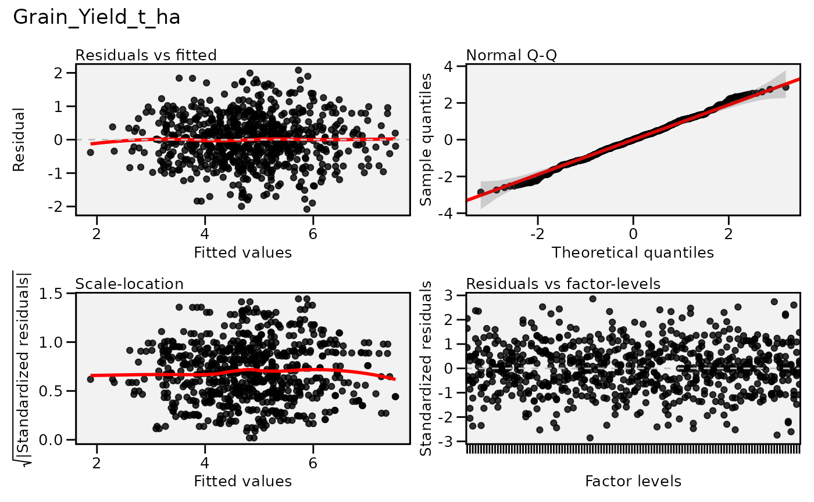
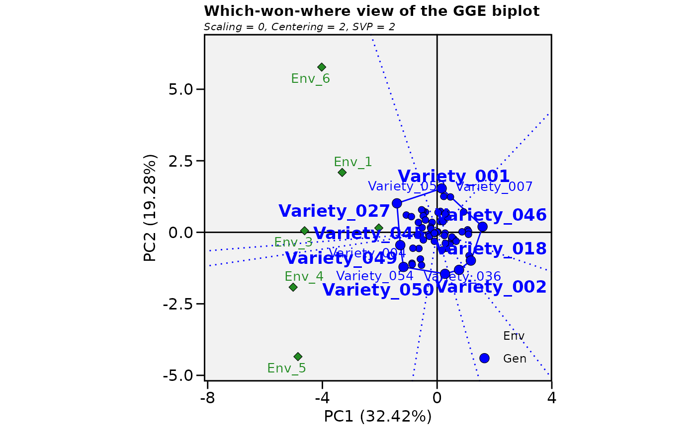

# Multi-Environment Trial (MET) Analysis with brapiR2

## Overview

Multi-environment trial (MET) analysis is a core workflow of a plant
breeding program: gather phenotypic observations from many locations and
years, then decompose genotype x environment (GxE) interaction to
identify stable, high-performing varieties.

This article has three parts: **Part 1** fetches real study, location,
and phenotype data from the public BrAPI test server and shows exactly
what brapiR2 returns. **Part 2** shows the authenticated, parallel-fetch
pattern you’d use against your own server, without running it. **Part
3** runs the actual GxE analysis — AMMI/GGE biplots (**metan**) and
mixed-model stability (**lme4**) — on a simulated trial, because Part
1’s real data is nowhere near large enough for either method.

## Part 1: Live Data from the Public Test Server

The three calls below return the pieces a multi-environment analysis is
assembled from. **Studies** are the environments themselves: one trial
grown at one site in one season. **Locations** carry the site metadata,
latitude, longitude, altitude and so on, that lets you group
environments sensibly or relate performance to conditions. **Seasons**
identify the planting cycle, which for maize may be a single year in
temperate programs or distinct long and short rains in East Africa.

The distinction between a location and an environment is worth being
precise about, because they are routinely conflated. An environment is a
location and season combination. The same site in two seasons
contributes two environments, and often two quite different ones, since
rainfall and temperature in a given year can matter more for yield than
the site itself. This is why a study, not a location, is the unit an
AMMI or GGE analysis treats as an environment.

``` r

library(brapiR2)
library(dplyr)
#> 
#> Attaching package: 'dplyr'
#> The following objects are masked from 'package:stats':
#> 
#>     filter, lag
#> The following objects are masked from 'package:base':
#> 
#>     intersect, setdiff, setequal, union

studies <- brapi_studies(con)
studies
#> # A tibble: 3 × 29
#>   additionalInfo   externalReferences active commonCropName contacts  
#>   <list>           <list>             <lgl>  <chr>          <list>    
#> 1 <named list [1]> <list [1]>         TRUE   Tomatillo      <list [1]>
#> 2 <named list [1]> <list [1]>         TRUE   Tomatillo      <list [1]>
#> 3 <named list [1]> <list [1]>         TRUE   Tomatillo      <list [1]>
#> # ℹ 24 more variables: culturalPractices <chr>, dataLinks <list>,
#> #   documentationURL <chr>, endDate <chr>, environmentParameters <list>,
#> #   experimentalDesign <list>, growthFacility <list>, lastUpdate <list>,
#> #   license <chr>, locationDbId <chr>, locationName <chr>,
#> #   observationLevels <list>, observationUnitsDescription <chr>,
#> #   seasons <list>, startDate <chr>, studyCode <chr>, studyDescription <chr>,
#> #   studyName <chr>, studyPUI <chr>, studyType <chr>, trialDbId <chr>, …

locations <- brapi_locations(con)
locations
#> # A tibble: 3 × 21
#>   additionalInfo   externalReferences abbreviation coordinateDescription        
#>   <list>           <list>             <chr>        <chr>                        
#> 1 <named list [1]> <list [1]>         L2           Outline of the institute bre…
#> 2 <named list [1]> <list [1]>         L3           Northwest corner post        
#> 3 <named list [1]> <list [1]>         L1           Northwest corner of greenhou…
#> # ℹ 17 more variables: coordinateUncertainty <chr>, coordinates <list>,
#> #   countryCode <chr>, countryName <chr>, documentationURL <chr>,
#> #   environmentType <chr>, exposure <chr>, instituteAddress <chr>,
#> #   instituteName <chr>, locationName <chr>, locationType <chr>,
#> #   siteStatus <chr>, slope <chr>, topography <chr>, parentLocationDbId <chr>,
#> #   parentLocationName <chr>, locationDbId <chr>

seasons <- brapi_seasons(con)
seasons
#> # A tibble: 10 × 3
#>    seasonDbId  seasonName  year
#>    <chr>       <chr>      <int>
#>  1 fall_2011   fall        2011
#>  2 fall_2012   fall        2012
#>  3 fall_2013   fall        2013
#>  4 spring_2012 spring      2012
#>  5 spring_2013 spring      2013
#>  6 summer_2012 summer      2012
#>  7 summer_2013 summer      2013
#>  8 winter_2012 winter      2012
#>  9 winter_2013 winter      2013
#> 10 winter_2014 winter      2014
```

``` r

# brapi_study_data() falls back to an unfiltered fetch + client-side filter
# when a server doesn't honour the studyDbId filter on /observations, so it
# finds data that a direct brapi_observations(con, studyDbId = ...) call
# would miss on this server. It still returns an honest empty tibble (with
# a warning) for studies that genuinely have no observations.
met_raw <- lapply(studies$studyDbId, brapi_study_data, con = con) |>
  bind_rows()
#> ! No observations found for study "study2".
#> ! No observations found for study "study3".
met_raw
#> # A tibble: 2 × 6
#>   observationUnitDbId observationUnitName germplasmDbId germplasmName  studyDbId
#>   <chr>               <chr>               <chr>         <chr>          <chr>    
#> 1 observation_unit1   Plot 1              germplasm1    Tomatillo Fan… study1   
#> 2 observation_unit2   Plot 2              germplasm2    Tomatillo Fan… study1   
#> # ℹ 1 more variable: `Corn Stalk Height` <list>
```

Only one of these three studies (`study1`) actually has recorded
observations on the public server today - two germplasm, one trait, as
the survey at
[`dev/explore-test-server.R`](https://github.com/ropensci/brapiR2/blob/main/dev/explore-test-server.R)
found. The other two studies come back empty. AMMI and GGE
decompositions need many genotypes scored across several environments to
estimate genotype, environment, and interaction effects separately; a
mixed model with a `germplasmName:env` random term needs enough
genotype-by-environment cells to avoid the fit being singular. Neither
is possible with this data, so Part 3 below simulates a properly-sized
trial instead.

## Part 2: Authenticated, Parallel Access to Your Own Server (illustrative)

Production BrAPI servers require credentials the public test server
doesn’t need, and
[`brapi_fetch_parallel()`](https://docs.ropensci.org/brapiR2/reference/brapi_fetch_parallel.md)
is most useful across many studies at once — this shows that pattern
without running it here.

``` r

con_priv <- brapi_connection("https://my-breedbase.org")
con_priv <- brapi_login(con_priv, "username", "password")

# Cache responses to speed up re-runs and protect server bandwidth
con_priv <- brapi_cache_enable(con_priv, ttl = 7200)
```

``` r

# Discover all studies in the target trial
trials_priv <- brapi_trials(con_priv, programDbId = "wheat_program_01")
trials_priv

# Focus on the current MET
studies_priv <- brapi_studies(con_priv, trialDbId = "trial_2022")
studies_priv

study_ids_priv <- studies_priv$studyDbId
```

[`brapi_fetch_parallel()`](https://docs.ropensci.org/brapiR2/reference/brapi_fetch_parallel.md)
uses the **furrr** package to run one worker per study concurrently,
against whatever `future` plan is already active. It does not set a
backend itself - per the future package’s best-practices vignette, that
choice belongs to the caller, not to the package, so you set the plan
yourself before calling it:

``` r

library(future)

future::plan(future::multisession, workers = 2)
met_priv <- brapi_fetch_parallel(con_priv, brapi_study_data, study_ids_priv)
glimpse(met_priv)
future::plan(future::sequential) # shut the workers back down when done
```

## Part 3: GxE Analysis on a Simulated Trial

The design below is a 60 genotype by 6 environment trial with 2
replicates, giving 720 plots. That is a realistic size for a regional
maize yield trial at the advanced testing stage, and it is roughly the
smallest design from which AMMI and GGE can estimate interaction
patterns with any confidence.

The relative sizes of the variance components are chosen to match how
yield data actually behaves rather than to make the analysis look tidy.
The environment effect is the largest of the three systematic terms
(environment, genotype, and genotype-by-environment), consistent with
site to site variation typically being the largest systematic source of
variation in a multi-environment trial - larger than the spread between
varieties within a site, though not so dominant that it drowns out the
genotype and genotype-by-environment signal this analysis exists to
recover. The genotype by environment variance is set larger than the
genotype variance, which is the usual finding in maize METs and is
precisely why this analysis exists at all. If varieties ranked the same
way everywhere, one trial would answer the question and there would be
nothing to decompose. The residual is larger still, reflecting plot to
plot variation from soil heterogeneity, stand establishment and
measurement error, which is why replication is not optional.

``` r

library(dplyr)
library(tidyr)

set.seed(123)

n_gen <- 60L
n_env <- 6L
n_rep <- 2L

genotypes    <- sprintf("Variety_%03d", seq_len(n_gen))
environments <- sprintf("Env_%d", seq_len(n_env))

overall_mean <- 5 # tonnes per hectare

# SIMULATED variance components. Real yield heritabilities are usually
# around 0.3-0.6; sd_g/sd_ge/sd_e below are chosen to land broad-sense H2
# near 0.5, not near 1 (see Part 3's mixed model below for the fitted value).
sd_g  <- 0.35
sd_ge <- 0.55
sd_e  <- 1.00

gen_effect <- setNames(rnorm(n_gen, sd = sd_g), genotypes)
env_effect <- setNames(rnorm(n_env, sd = 0.60), environments)
ge_effect <- outer(genotypes, environments, function(g, e) {
  rnorm(length(g), sd = sd_ge)
})
dimnames(ge_effect) <- list(genotypes, environments)

met <- expand_grid(
  germplasmName = genotypes,
  env = environments,
  rep = seq_len(n_rep)
) |>
  mutate(
    observationUnitDbId = sprintf("plot_%04d", row_number()),
    Grain_Yield_t_ha = overall_mean +
      gen_effect[germplasmName] +
      env_effect[env] +
      ge_effect[cbind(germplasmName, env)] +
      rnorm(n(), sd = sd_e) # SIMULATED residual (plot-to-plot) noise
  )

nrow(met)
#> [1] 720
head(met)
#> # A tibble: 6 × 5
#>   germplasmName env     rep observationUnitDbId Grain_Yield_t_ha
#>   <chr>         <chr> <int> <chr>                          <dbl>
#> 1 Variety_001   Env_1     1 plot_0001                       7.68
#> 2 Variety_001   Env_1     2 plot_0002                       5.29
#> 3 Variety_001   Env_2     1 plot_0003                       6.27
#> 4 Variety_001   Env_2     2 plot_0004                       3.19
#> 5 Variety_001   Env_3     1 plot_0005                       5.02
#> 6 Variety_001   Env_3     2 plot_0006                       5.59
```

### Means Matrix for GxE Analysis

Many GxE methods (AMMI, GGE biplot) require a two-way table of genotype
means per environment.

``` r

# Compute adjusted means (plot-level mean per genotype x environment)
means <- met |>
  group_by(germplasmName, env) |>
  summarise(yield = mean(Grain_Yield_t_ha, na.rm = TRUE), .groups = "drop")

# Wide format: rows = genotypes, columns = environments
means_wide <- means |>
  pivot_wider(names_from = env, values_from = yield)

means_wide
#> # A tibble: 60 × 7
#>    germplasmName Env_1 Env_2 Env_3 Env_4 Env_5 Env_6
#>    <chr>         <dbl> <dbl> <dbl> <dbl> <dbl> <dbl>
#>  1 Variety_001    6.48  4.73  5.31  3.78  2.52  6.09
#>  2 Variety_002    4.68  4.27  5.00  3.32  5.05  2.74
#>  3 Variety_003    7.52  5.29  4.89  4.88  5.55  6.46
#>  4 Variety_004    6.44  4.74  5.78  5.28  6.35  4.17
#>  5 Variety_005    4.97  6.23  5.04  4.39  5.84  7.30
#>  6 Variety_006    4.73  6.17  5.87  4.78  4.26  5.05
#>  7 Variety_007    6.40  4.08  5.90  3.56  2.09  5.12
#>  8 Variety_008    4.45  4.57  3.19  4.08  2.97  5.62
#>  9 Variety_009    4.12  4.16  4.53  4.95  3.97  4.58
#> 10 Variety_010    7.01  5.93  5.34  3.81  4.34  5.57
#> # ℹ 50 more rows
```

### AMMI and GGE Biplot with metan

Both methods start from the same observation: the two-way table of
genotype by environment means contains a pattern that main effects alone
cannot describe. They differ in what they do about it.

**AMMI** removes the additive part first, fitting genotype and
environment main effects by analysis of variance, then applies principal
components to what remains, which is the interaction. The first
interaction principal component, IPCA1, captures the dominant pattern in
how varieties respond differently across sites. In the AMMI1 biplot
below, the horizontal axis is mean yield and the vertical axis is the
IPCA1 score. A genotype plotted near zero on the vertical axis performs
consistently relative to the others across environments; one plotted far
from zero has yield that depends strongly on where it is grown. The
point far to the right on mean yield and close to the horizontal axis,
high mean and near zero interaction, is the broadly adapted variety.

**GGE** keeps the genotype main effect together with the interaction and
discards the environment main effect. The reasoning is that the
environment effect, however large, is useless for choosing a variety:
knowing that one site yields more than another tells you nothing about
which line to release. What matters for selection is genotype and its
interaction, hence G plus GE. The which-won-where view draws a polygon
through the most extreme genotypes and divides it into sectors with
perpendicular rays. The genotype at the vertex of each sector is the
best performer for the environments falling in it. When all environments
land in a single sector, one variety wins everywhere and the target
region behaves as a single mega-environment. When they split across
sectors, the region does not, and that is an argument for breeding for
specific adaptation rather than for a single broadly adapted release.

``` r

library(metan)
#> |=========================================================|
#> | Multi-Environment Trial Analysis (metan) v1.19.0        |
#> | Author: Tiago Olivoto                                   |
#> | Type 'citation('metan')' to know how to cite metan      |
#> | Type 'vignette('metan_start')' for a short tutorial     |
#> | Visit 'https://bit.ly/metanpkg' for a complete tutorial |
#> |=========================================================|
#> 
#> Attaching package: 'metan'
#> The following object is masked from 'package:tidyr':
#> 
#>     replace_na
#> The following object is masked from 'package:dplyr':
#> 
#>     recode_factor

# AMMI model: decompose GxE with additive main effects + multiplicative
# interaction
ammi_model <- performs_ammi(
  .data = met,
  env = env,
  gen = germplasmName,
  rep = rep, # replicate number, not the plot ID
  resp = Grain_Yield_t_ha,
  verbose = FALSE
)
#> Warning: There was 1 warning in `summarise()`.
#> ℹ In argument: `across(where(is.numeric), mean, na.rm = na.rm)`.
#> ℹ In group 1: `GEN = Variety_001`, `ENV = Env_1`.
#> Caused by warning:
#> ! The `...` argument of `across()` is deprecated as of dplyr 1.1.0.
#> Supply arguments directly to `.fns` through an anonymous function instead.
#> 
#>   # Previously
#>   across(a:b, mean, na.rm = TRUE)
#> 
#>   # Now
#>   across(a:b, \(x) mean(x, na.rm = TRUE))
#> ℹ The deprecated feature was likely used in the metan package.
#>   Please report the issue at <https://github.com/nepem-ufsc/metan/issues>.

# AMMI stability value (ASV) - lower = more stable across environments
ammi_stable <- ammi_indexes(ammi_model)
ammi_stable$Grain_Yield_t_ha |>
  arrange(ASV) |>
  head(10)
#> # A tibble: 10 × 42
#>    GEN        Y   Y_R   ASTAB ASTAB_R ssiASTAB    ASI ASI_R ASI_SSI    ASV ASV_R
#>    <chr>  <dbl> <dbl>   <dbl>   <dbl>    <dbl>  <dbl> <dbl>   <dbl>  <dbl> <dbl>
#>  1 Varie…  5.21    18 0.00295       1       19 0.0150     1      19 0.0591     1
#>  2 Varie…  4.63    40 0.00879       2       42 0.0237     2      42 0.0937     2
#>  3 Varie…  5.10    22 0.0110        3       25 0.0285     3      25 0.113      3
#>  4 Varie…  4.39    50 0.0145        5       55 0.0325     4      54 0.128      4
#>  5 Varie…  3.93    58 0.0143        4       62 0.0336     5      63 0.133      5
#>  6 Varie…  4.02    57 0.0157        6       63 0.0343     6      63 0.135      6
#>  7 Varie…  4.14    54 0.0361        7       61 0.0492     7      61 0.194      7
#>  8 Varie…  4.94    26 0.0450        8       34 0.0538     8      34 0.213      8
#>  9 Varie…  5.14    20 0.0470       12       32 0.0551     9      29 0.218      9
#> 10 Varie…  4.86    28 0.0451       10       38 0.0576    10      38 0.227     10
#> # ℹ 31 more variables: ASV_SSI <dbl>, AVAMGE <dbl>, AVAMGE_R <dbl>,
#> #   AVAMGE_SSI <dbl>, DA <dbl>, DA_R <dbl>, DA_SSI <dbl>, DZ <dbl>, DZ_R <dbl>,
#> #   DZ_SSI <dbl>, EV <dbl>, EV_R <dbl>, EV_SSI <dbl>, FA <dbl>, FA_R <dbl>,
#> #   FA_SSI <dbl>, MASI <dbl>, MASI_R <dbl>, MASI_SSI <dbl>, MASV <dbl>,
#> #   MASV_R <dbl>, MASV_SSI <dbl>, SIPC <dbl>, SIPC_R <dbl>, SIPC_SSI <dbl>,
#> #   ZA <dbl>, ZA_R <dbl>, ZA_SSI <dbl>, WAAS <dbl>, WAAS_R <dbl>,
#> #   WAAS_SSI <dbl>

# AMMI1 biplot: IPCA1 scores vs mean yield
plot(ammi_model, type = "AMMI1")
#> Warning: The `size` argument of `element_rect()` is deprecated as of ggplot2 3.4.0.
#> ℹ Please use the `linewidth` argument instead.
#> ℹ The deprecated feature was likely used in the metan package.
#>   Please report the issue at <https://github.com/nepem-ufsc/metan/issues>.
#> This warning is displayed once per session.
#> Call `lifecycle::last_lifecycle_warnings()` to see where this warning was
#> generated.
#> Warning: Using `size` aesthetic for lines was deprecated in ggplot2 3.4.0.
#> ℹ Please use `linewidth` instead.
#> ℹ The deprecated feature was likely used in the metan package.
#>   Please report the issue at <https://github.com/nepem-ufsc/metan/issues>.
#> This warning is displayed once per session.
#> Call `lifecycle::last_lifecycle_warnings()` to see where this warning was
#> generated.
#> Warning: `aes_()` was deprecated in ggplot2 3.0.0.
#> ℹ Please use tidy evaluation idioms with `aes()`
#> ℹ The deprecated feature was likely used in the metan package.
#>   Please report the issue at <https://github.com/nepem-ufsc/metan/issues>.
#> This warning is displayed once per session.
#> Call `lifecycle::last_lifecycle_warnings()` to see where this warning was
#> generated.
```



``` r

# GGE biplot
gge_model <- gge(
  .data = met,
  env   = env,
  gen   = germplasmName,
  rep   = rep,
  resp  = Grain_Yield_t_ha
)

plot(gge_model, type = 3) # "which-won-where" view
```



### Mixed Model Stability with lme4

For unbalanced data or when you need BLUPs rather than means, fit a
mixed model with genotype x environment interaction as a random effect.

``` r

library(lme4)
#> Loading required package: Matrix
#> 
#> Attaching package: 'Matrix'
#> The following objects are masked from 'package:tidyr':
#> 
#>     expand, pack, unpack

# Basic mixed model: GxE interaction as random
fm <- lmer(
  Grain_Yield_t_ha ~ env + (1 | germplasmName) + (1 | germplasmName:env),
  data = met
)
summary(fm)
#> Linear mixed model fit by REML ['lmerMod']
#> Formula: Grain_Yield_t_ha ~ env + (1 | germplasmName) + (1 | germplasmName:env)
#>    Data: met
#> 
#> REML criterion at convergence: 2264.3
#> 
#> Scaled residuals: 
#>      Min       1Q   Median       3Q      Max 
#> -2.70727 -0.62082 -0.00321  0.56782  2.61456 
#> 
#> Random effects:
#>  Groups            Name        Variance Std.Dev.
#>  germplasmName:env (Intercept) 0.1912   0.4373  
#>  germplasmName     (Intercept) 0.1530   0.3912  
#>  Residual                      1.0784   1.0385  
#> Number of obs: 720, groups:  germplasmName:env, 360; germplasmName, 60
#> 
#> Fixed effects:
#>             Estimate Std. Error t value
#> (Intercept)   5.2908     0.1213  43.602
#> envEnv_2     -0.5028     0.1560  -3.222
#> envEnv_3     -0.3586     0.1560  -2.298
#> envEnv_4     -0.7491     0.1560  -4.801
#> envEnv_5     -0.9046     0.1560  -5.797
#> envEnv_6     -0.2218     0.1560  -1.421
#> 
#> Correlation of Fixed Effects:
#>          (Intr) envE_2 envE_3 envE_4 envE_5
#> envEnv_2 -0.643                            
#> envEnv_3 -0.643  0.500                     
#> envEnv_4 -0.643  0.500  0.500              
#> envEnv_5 -0.643  0.500  0.500  0.500       
#> envEnv_6 -0.643  0.500  0.500  0.500  0.500

# Extract BLUPs for genotypic effects
blups <- ranef(fm)$germplasmName
blups <- tibble(
  germplasmName = rownames(blups),
  BLUP          = blups[["(Intercept)"]]
) |>
  arrange(desc(BLUP))

head(blups, 10)
#> # A tibble: 10 × 2
#>    germplasmName  BLUP
#>    <chr>         <dbl>
#>  1 Variety_027   0.667
#>  2 Variety_003   0.518
#>  3 Variety_045   0.503
#>  4 Variety_005   0.443
#>  5 Variety_049   0.398
#>  6 Variety_038   0.382
#>  7 Variety_004   0.349
#>  8 Variety_054   0.315
#>  9 Variety_037   0.284
#> 10 Variety_010   0.277

# Variance component partitioning
VarCorr(fm)
#>  Groups            Name        Std.Dev.
#>  germplasmName:env (Intercept) 0.43730 
#>  germplasmName     (Intercept) 0.39119 
#>  Residual                      1.03845

# H^2 broad-sense heritability (across-environment), from the FITTED
# variance components (not the true simulated ones above - estimation noise
# means these won't match exactly).
var_g <- as.numeric(VarCorr(fm)$germplasmName)
var_ge <- as.numeric(VarCorr(fm)$`germplasmName:env`)
var_e <- sigma(fm)^2
n_env_obs <- length(unique(met$env))

H2 <- var_g / (var_g + var_ge / n_env_obs + var_e / (n_env_obs * n_rep))
cat(sprintf("Broad-sense H^2 (across environments): %.3f\n", H2))
#> Broad-sense H^2 (across environments): 0.557
```

With `sd_g = 0.35`, `sd_ge = 0.55`, `sd_e = 1.00` the true (simulated)
H2 is about 0.48; the model fitted above typically recovers something in
the same neighbourhood, comfortably inside the ~0.3-0.6 range real yield
heritabilities fall in — not the unrealistically high value (0.9) that
an earlier, less careful choice of variance components produced.

### Final Selection List

The weights below, 0.6 on yield and 0.4 on stability, are a choice
rather than a standard, and they should reflect what your program is
actually selecting for.

The tradeoff behind them is real. The highest yielding line is
frequently not the most stable: it wins substantially at favourable
sites and falls away under stress, which shows up as a high mean with a
large ASV. A stable line yields moderately more or less everywhere.
Which of the two a breeder should prefer depends on the target
population of environments and on who is growing the crop. For maize
under irrigation with reliable inputs, where the conditions the variety
will meet are close to the favourable end of the trials, weighting yield
heavily is defensible. For smallholder production under variable
rainfall, where a failed season carries consequences a good season does
not offset, stability deserves more weight than yield, and a 0.4/0.6
split in the other direction would be the more sensible starting point.

One limitation worth noting: both components are rank-normalised before
combining, which makes them comparable but discards magnitude. A line
marginally ahead on yield and one far ahead contribute the same rank
difference. If the size of the yield advantage matters to the decision,
scale the components rather than ranking them.

``` r

# Combine BLUP ranking with stability
stability <- ammi_stable$Grain_Yield_t_ha |>
  select(GEN, mean_yield = Y, ASV) |>
  rename(germplasmName = GEN)

selection <- blups |>
  left_join(stability, by = "germplasmName") |>
  mutate(
    # Normalise both metrics (0 = worst, 1 = best)
    rank_yield = rank(BLUP) / n(),
    rank_stab  = 1 - rank(ASV) / n(), # lower ASV = more stable = better
    score      = 0.6 * rank_yield + 0.4 * rank_stab
  ) |>
  arrange(desc(score))

# Top 10 selections: high yield + high stability
head(selection, 10)
#> # A tibble: 10 × 7
#>    germplasmName   BLUP mean_yield    ASV rank_yield rank_stab score
#>    <chr>          <dbl>      <dbl>  <dbl>      <dbl>     <dbl> <dbl>
#>  1 Variety_003   0.518        5.77 0.285       0.983     0.733 0.883
#>  2 Variety_005   0.443        5.63 0.268       0.95      0.767 0.877
#>  3 Variety_032   0.210        5.21 0.0591      0.717     0.983 0.823
#>  4 Variety_051   0.237        5.26 0.236       0.783     0.8   0.79 
#>  5 Variety_013   0.145        5.10 0.113       0.65      0.95  0.77 
#>  6 Variety_044   0.239        5.26 0.312       0.8       0.7   0.76 
#>  7 Variety_006   0.172        5.14 0.218       0.683     0.85  0.75 
#>  8 Variety_038   0.382        5.52 0.438       0.917     0.433 0.723
#>  9 Variety_027   0.667        6.03 0.668       1         0.267 0.707
#> 10 Variety_035   0.0600       4.94 0.213       0.583     0.867 0.697
```

As with the [genomic selection
article](https://docs.ropensci.org/brapiR2/articles/genomic-selection-pipeline.md),
the numbers in Part 3 describe a simulated trial and are only meant to
demonstrate that the pipeline (fetch -\> reshape -\> AMMI/GGE -\> mixed
model -\> selection) runs end to end; they say nothing about any real
breeding program.

## References

- Selby, P., Abbeloos, R., Backlund, J.E., et al., & The BrAPI
  Consortium (2019). BrAPI — an application programming interface for
  plant breeding applications. *Bioinformatics*, 35(20), 4147–4155.
  <https://doi.org/10.1093/bioinformatics/btz190>
- Zobel, R.W., Wright, M.J., & Gauch, H.G. (1988). Statistical analysis
  of a yield trial. *Agronomy Journal*, 80(3), 388–393.
  <https://doi.org/10.2134/agronj1988.00021962008000030002x>
- Yan, W., Hunt, L.A., Sheng, Q., & Szlavnics, Z. (2000). Cultivar
  evaluation and mega-environment investigation based on the GGE biplot.
  *Crop Science*, 40(3), 597–605.
  <https://doi.org/10.2135/cropsci2000.403597x>
- Olivoto, T., & Lúcio, A.D. (2020). metan: An R package for
  multi-environment trial analysis. *Methods in Ecology and Evolution*,
  11(6), 783–789. <https://doi.org/10.1111/2041-210X.13384>
- Bates, D., Mächler, M., Bolker, B., & Walker, S. (2015). Fitting
  linear mixed-effects models using lme4. *Journal of Statistical
  Software*, 67(1), 1–48. <https://doi.org/10.18637/jss.v067.i01>
